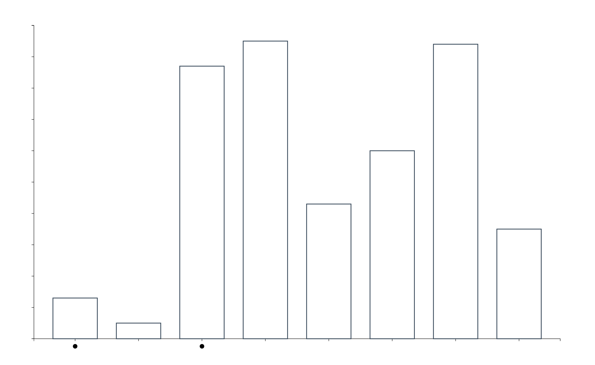
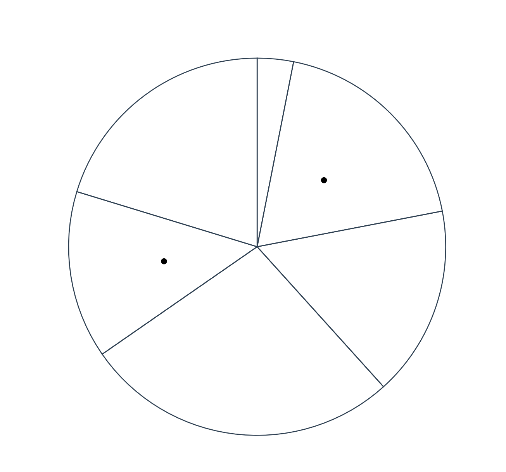
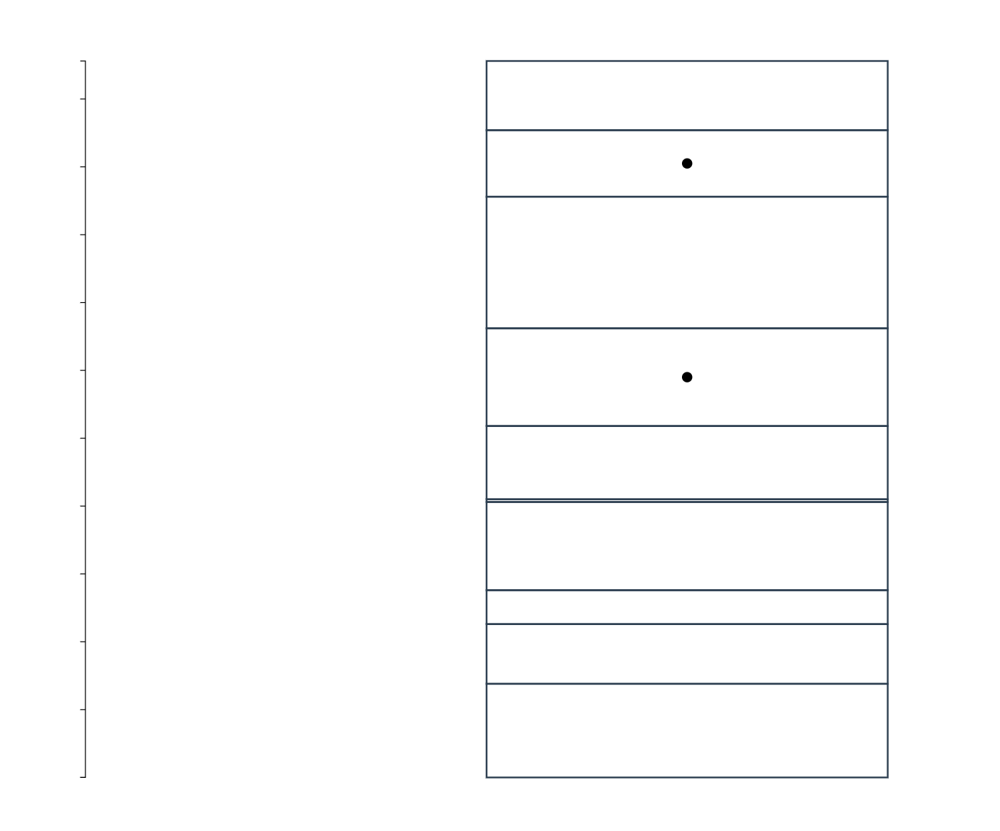
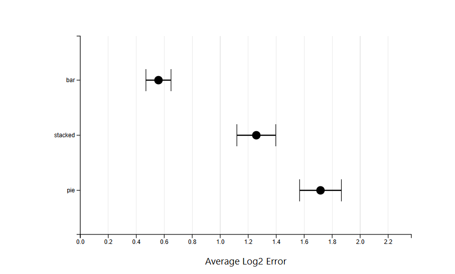

Assignment 3 - Replicating a Classic Experiment  
===
Authors: Zihan Li, Wentao Yu

link to the experiment:

Experiment Overview
===
For this project, we're running a controlled experiment to test human graphical perception.
The Question: "What percentage is the smaller value of the larger value?"
The Setup: Participants were shown 60 trials in a randomized order (20 Bar, 20 Pie, 20 Stacked Bar).
The Data: Each trial consisted of 5–10 random data points. Two points were marked with black dots for comparison.
Participants: 10 users participated, providing a total of 600 data points for analysis.

The Hypothesis
===
We hypothesized that Bar Charts would result in the lowest error because humans excel at judging position along a common scale. We predicted that Pie Charts  and Stacked Bar Charts would lead to significantly higher error rates.

Visualization Screenshots
===
The experiment used minimalist, high-contrast designs to isolate the perceptual task from any color or labeling bias.

 - Bar Chart

 - Pie Chart

 - Stacked Bar Chart

 - 
Rankings (Best to Worst)
===
   Based on the average Log2 Error, our experiment produced the following rankings:
1. Bar Chart (Avg Error: ~0.56)
2. Stacked Bar Chart (Avg Error: ~1.26)
3. Pie Chart (Avg Error: ~1.72)

Analysis Results
===
The graph below was generated using the built-in Analysis Tool of this application, using the master dataset of 600 trials (10 participants), Base on this result, Our results successfully prove the hypothesis.
Bar Charts performed significantly better than the others.

Technical Achievements
===
-  We built a graph analysis page directly into the application. This tool uses D3.js to parse raw CSV data, calculate the mean log-error, and determine 95% Confidence Intervals automatically. This allows user to visualize results instantly without external software.

Design Achievements
===
- We add a Nav Bar at the top of the interface. This allowing the user to jump between the Home , Experiment, Data View (CSV Export), and Analysis sections.
